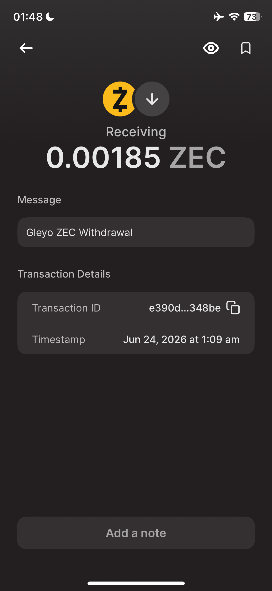

# Gleyo — ZEC-Native Quest & Community Growth Platform

Gleyo is a Zcash-native quest and community growth platform where any project — Zcash ecosystem or otherwise — can create tasks, reward contributors directly in ZEC, and track real community retention. No vanity metrics, no multi-token complexity, no detached Discord. Just ZEC, shielded by default.

Built for the [ZecHub Hackathon 2026](https://zechub.wiki/hackathon) — Infrastructure Track.

Gleyo's feature set naturally spans the contributor lifecycle — education, onboarding, activation, skill development, alignment, and retention — concepts discussed at ZecHub's Contributor Workshop (June 8, 2026).

---

## How it compares

| Feature | Dework | Zealy | Gleyo |
|---|---|---|---|
| Token rewards | Multi-token (DAO native, ERC-20) | Multi-token (points, ERC-20) | **ZEC only** |
| Wallet login | MetaMask, web3 wallets | Web2 + Web3 | **Zcash shielded wallet only** |
| Analytics | Basic task completion | Discord/Twitter vanity metrics | **Retention rate, dropoff %, growth signals** |
| Community | Discord-synced | Detached Discord/Twitter | **Built-in ZEC-native community chat** |
| Privacy | None — on-chain traceable | None | **Shielded by default via Orchard** |
| Reward payout | Custodial, multi-chain | Custodial | **Non-custodial, straight to user shielded wallet** |
| Zcash support | None | None | **Native — built on Zcash** |

---

## What Gleyo does

Any project building on Zcash — or any project outside the ecosystem that wants to pay contributors in ZEC — can sign up, fund a community wallet with ZEC, and start creating quests. Here's the full flow:

**For project owners:**
- Create a community and fund it by sending ZEC to Gleyo's shielded address
- Gleyo verifies the deposit via Nozy Wallet + Zebra node (balance delta check on Zcash mainnet)
- Create quests with XP rewards and/or ZEC token rewards
- Publish quests — funds are locked per quest from the community wallet
- Review submissions and approve — ZEC is credited to the winner's reward hub automatically
- View retention analytics: active members over 7d/30d/90d, quest completion rates, average completion time, dropoff percentage, and growth opportunity signals

**For community members:**
- Authentication is done via a micro-transaction memo code (0.00001 ZEC to Gleyo's address with a session code in the memo field)
- Browse and complete quests, claim XP and ZEC rewards
- Withdraw ZEC directly to a Unified shielded Zcash address (u1...) — Gleyo processes the send via Nozy API + Zebra, transaction confirms on-chain within minutes
- Participate in the community chat

---

## Features

* **ZEC-only rewards** — admins fund tasks in ZEC, users withdraw in ZEC, no other token supported
* **Zcash wallet verification** — users can create an account with email, then connect and verify ownership of a Unified shielded Zcash wallet (u1...) using micro-transaction memo verification to access ZEC-powered functionality.
* **Quest system** — admins create tasks with XP and/or ZEC reward pools, users complete and claim
* **Instant reward crediting** — approved submissions credit ZEC to the user's in-app reward hub immediately
* **Shielded withdrawals** — users withdraw to a Unified shielded address (u1...), routed through Orchard, Gleyo sends via Nozy API with memo `Gleyo ZEC Withdrawal`
* **Multi-platform task system** — quest tasks can require actions across GitHub (star/fork), Discord, Telegram, and YouTube, plus link-visit tasks, with Twitter/X, TikTok, and webhook-based task verification in progress (see limitations)
* **XP & community standings** — quest completions earn XP that builds a member's reputation score within each community. Members can see their standing and track progress over time, driving ongoing engagement beyond one-time ZEC reward hunting.
* **Community chat** — built-in community space, no Discord required
* **Web Push notifications** — members receive real-time notifications inside and outside the app for events like new quest publications, community mentions, and chat activity, even when Gleyo is closed (with browser permission)
* **Retention analytics:**
  - Active members over 7d / 30d / 90d
  - Quest completion rate and average completion time
  - Dropoff percentage with friction point detection
  - Growth opportunity signals: e.g. `2x users are more likely to stay if you run weekly quests`
  - Risk alerts: e.g. `You experienced 2% dropoff — possible onboarding friction on mobile`

---

## How the ZEC flow works

```
Project owner sends ZEC to Gleyo shielded address
        ↓
Gleyo verifies via Nozy API sync (balance delta on Zebra node)
        ↓
Community wallet credited in zatoshi
        ↓
Project owner creates quest with ZEC reward
        ↓
User completes quest → admin approves
        ↓
ZEC credited to user's Gleyo reward hub (UserBalance)
        ↓
User withdraws to their shielded address
        ↓
Gleyo sends via Nozy API → Zebra node → Zcash mainnet
        ↓
Transaction confirms in user's wallet within ~3 minutes
```

All transactions are shielded Orchard spends. The memo field on every withdrawal reads `Gleyo ZEC Withdrawal` so the recipient knows exactly where funds came from.

---

## Tech Stack

- **Backend** — Python (Flask), SQLAlchemy, PostgreSQL (production) / SQLite (local dev)
- **Frontend** — HTML, CSS, JavaScript (no framework)
- **Zcash node** — [Zebra](https://github.com/ZcashFoundation/zebra) (Zcash Foundation full node)
- **Wallet backend** — [Nozy Wallet](https://github.com/LEONINE-DAO/Nozy-wallet) by LEONINE DAO (Rust, runs on port 3000)
- **Task integrations** — GitHub OAuth, Twitter OAuth, Discord bot, Telegram bot, TikTok
- **Email** — Resend + SMTP fallback
- **Push notifications** — Web Push (VAPID)
- **Cache** — Redis

> Gleyo does not require lightwalletd. Nozy Wallet connects to Zebra directly for compact block sync and shielded transaction broadcasting.

---

## Setup

### Requirements

- Python 3.10+
- Git
- Rust (for building Nozy API server)
- A running Zebra node (Ubuntu VPS, 400GB+ SSD recommended)

---

### 1. Clone the repo

```bash
git clone https://github.com/gilmorre/zechub
cd gleyo-Zechub-
```

### 2. Virtual environment

```bash
# Windows
python -m venv venv
venv\Scripts\activate

# Mac/Linux
python3 -m venv venv
source venv/bin/activate
```

### 3. Install dependencies

```bash
pip install -r requirements.txt
```

### 4. Environment variables

Create a `.env` file in the root:

```env
# ── App ──────────────────────────────────────────────
SECRET_KEY=your_secret_key

# ── ZEC Wallet ───────────────────────────────────────
WALLET=u1...                          # Gleyo's platform shielded address (receives deposits)
ZCASHD_FROM_ADDRESS=u1...             # Address Nozy sends withdrawals from
NOZY_API_URL=http://127.0.0.1:3000    # Nozy API server URL
NOZY_API_KEY=                        # Optional — only needed if Nozy server enforces API key auth (set NOZY_API_KEY on the Nozy server to require this)
NOZY_WALLET_PASSWORD=your_password

# ── Database ─────────────────────────────────────────
# DATABASE_URL=postgresql://...       # Production uses Postgres (AWS RDS). Defaults to SQLite if unset, for local dev.

# ── Email ────────────────────────────────────────────
MAIL_USER=your_email@gmail.com
MAIL_PASS=your_app_password
RESEND_API_KEY=your_resend_key
EMAIL_FROM=Gleyo <noreply@gleyo.app>
SMTP_PORT=587
SMTP_USERNAME=your_email@gmail.com
SMTP_PASSWORD=your_app_password
ADMIN_EMAIL=your_admin_email

# ── GitHub OAuth ─────────────────────────────────────
GITHUB_CLIENT_ID=your_github_client_id
GITHUB_CLIENT_SECRET=your_github_client_secret
GITHUB_REDIRECT_URI=https://yourdomain.com/github/callback

# ── Twitter OAuth ────────────────────────────────────
TWITTER_CLIENT_ID=your_twitter_client_id
TWITTER_CLIENT_SECRET=your_twitter_client_secret
TWITTER_REDIRECT_URI=https://yourdomain.com/twitter-callback
TWITTER_BEARER_TOKEN=your_bearer_token
COMM_TWITTER_CLIENT_ID=your_community_twitter_client_id
COMM_TWITTER_CLIENT_SECRET=your_community_twitter_client_secret
COMM_TWITTER_REDIRECT_URI=https://yourdomain.com/community-twitter-callback

# ── Discord ──────────────────────────────────────────
DISCORD_BOT_TOKEN=your_discord_bot_token
BOT_DISCORD_CLIENT_ID=your_bot_client_id
BOT_DISCORD_CLIENT_SECRET=your_bot_client_secret
BOT_DISCORD_REDIRECT_URI=https://yourdomain.com/bot/callback
DISCORD_REDIRECT_URI=https://yourdomain.com/discord/callback

# ── Telegram ─────────────────────────────────────────
TELEGRAM_BOT_TOKEN=your_telegram_bot_token

# ── TikTok ───────────────────────────────────────────
TIKTOK_CLIENT_KEY=your_tiktok_client_key
TIKTOK_CLIENT_SECRET=your_tiktok_client_secret
TIKTOK_REDIRECT_URI=https://yourdomain.com/tiktok/callback

# ── YouTube ──────────────────────────────────────────
YOUTUBE_API_KEY=your_youtube_api_key

# ── Push Notifications ───────────────────────────────
VAPID_PUBLIC_KEY=your_vapid_public_key
VAPID_PRIVATE_KEY=your_vapid_private_key

# ── Redis ────────────────────────────────────────────
REDIS_URL=redis://your_redis_url

# ── Supabase (optional storage) ──────────────────────
SUPABASE_URL=https://your-project.supabase.co
SUPABASE_KEY=your_supabase_anon_key

# ── APIs ─────────────────────────────────────────────
RAPIDAPI_KEY=your_rapidapi_key
```

### 5. Run the app

```bash
python app.py
```

App runs at **http://127.0.0.1:8000**

---

## Zebra Node Setup

Gleyo uses a self-hosted Zebra full node for Zcash mainnet access. Nozy Wallet connects to Zebra directly — no lightwalletd required.

### Install Rust

```bash
curl --proto '=https' --tlsv1.2 -sSf https://sh.rustup.rs | sh
source $HOME/.cargo/env
```

### Install and run Zebra

```bash
git clone https://github.com/ZcashFoundation/zebra
cd zebra
cargo install --locked --bin zebrad zebrad
zebrad start
```

> Zebra must sync to Orchard activation height (~1.8M blocks) before Nozy can operate. Full sync to mainnet tip (~3.38M+ blocks) is required for live withdrawals and deposit verification.

---

## Nozy API Server Setup

The [Nozy Wallet](https://github.com/LEONINE-DAO/Nozy-wallet) API server by LEONINE DAO is a Rust REST API that wraps the Nozy wallet backend and exposes it via HTTP on port 3000. Gleyo uses it to sync with Zebra, check balances, and send shielded transactions.

```bash
# Install protobuf compiler (required for zeaking/build.rs)
sudo apt install protobuf-compiler

# Clone and build
git clone https://github.com/LEONINE-DAO/Nozy-wallet.git
cd Nozy-wallet/api-server
cargo build --release
cargo run
```

API server runs at **http://0.0.0.0:3000**

See the [Nozy API docs](https://github.com/LEONINE-DAO/Nozy-wallet/blob/main/api-server/README.md) for full endpoint reference.

---

## Zcash mainnet usage

- All deposits are received at Gleyo's shielded Orchard address
- Deposit verification uses Nozy `/api/sync` balance delta — no memo scanning required for deposits
- Wallet authentication uses a 0.00001 ZEC micro-transaction with a session code in the shielded memo field
- Quest rewards are credited to users' in-app balances on approval
- Withdrawals are sent as shielded Orchard transactions via Nozy API with memo `Gleyo ZEC Withdrawal`
- All on-chain activity goes through Zcash mainnet via the self-hosted Zebra node

---

## Live on Zcash Mainnet

A confirmed shielded withdrawal, processed end-to-end through Gleyo's Nozy + Zebra integration:



---

## Current limitations

Gleyo is live and processing real ZEC on mainnet, but it's currently in closed beta while these are addressed before public launch:

- **Withdrawal concurrency** — withdrawals are currently processed one at a time platform-wide; per-user concurrent handling is planned next.
- **Security audit** — the codebase has been tested extensively in production with real funds, but hasn't yet had an independent third-party review.
- **Infrastructure redundancy** — Zebra and Nozy currently run on a single VPS without failover.
- **Unified addresses only** — withdrawals currently require a Unified (u1...) shielded address, routed through Orchard. Legacy Sapling-only wallets (zs1...) aren't yet supported for receiving withdrawals; users on older wallets will need to upgrade to a Unified-address wallet.
- **Twitter/X, TikTok, and webhook task verification** — GitHub, Discord, Telegram, YouTube, and link-visit task verification are fully live. Twitter/X verification is currently blocked by API access costs; TikTok requires video-based verification that's still in development; webhook-based task verification is also still under development. All three are being worked on post-hackathon.

---

## Future work

* **Member rewards** — enable project owners to send direct ZEC tips to active community members from within the community chat to encourage participation and recognize contributions.

* **Quest recommendations & AI insights** — introduce personalized quest suggestions and optional AI-assisted review tools to help surface relevant quests, summarize submissions, and assist moderators with reviewing community activity.

* **Expanded wallet onboarding & verification** — simplify the process of connecting and verifying shielded Zcash wallets while keeping access to ZEC-powered functionality secure.

* **Additional notification channels & automation** — expand notifications beyond browser push to include smarter delivery preferences, community activity alerts, and automated engagement workflows.

* **Billing & invoicing tab** — explore optional integration with Zcash-native payment infrastructure (e.g. CipherPay) to support recurring community funding, billing, and invoicing workflows directly in ZEC while preserving Gleyo’s native funding model.


---

## Credits & Thanks

- **[LOWO](https://github.com/lowo88)** — creator of [Nozy Wallet](https://github.com/LEONINE-DAO/Nozy-wallet), for the relentless bug fixes and quick turnarounds that made shielded payment verification and withdrawals possible
- **[Zcash Foundation](https://www.zfnd.org/)** — for building and maintaining [Zebra](https://github.com/ZcashFoundation/zebra), the full node powering all of Gleyo's mainnet activity
- **[Dismad](https://github.com/dismad)** — for pointing me toward the [ZecHub Developer docs](https://zechub.wiki/developers/quick-start) and guiding me on setting up Zebra
- **[Tron](https://github.com/onajifortune)** — whose tutorial video was a huge help in getting Zebra running
- **Dre & the ZecHub Developer Workshop series** — for creating the space that connected builders with the knowledge, discussions, and technical sessions that helped shape parts of Gleyo’s journey.
---

## Demo

[Watch the demo](#) — coming soon

---

## License

MIT License — see [LICENSE](./LICENSE)