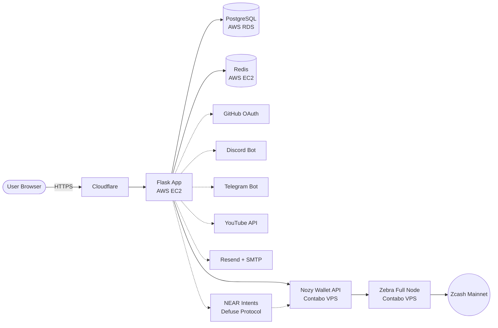
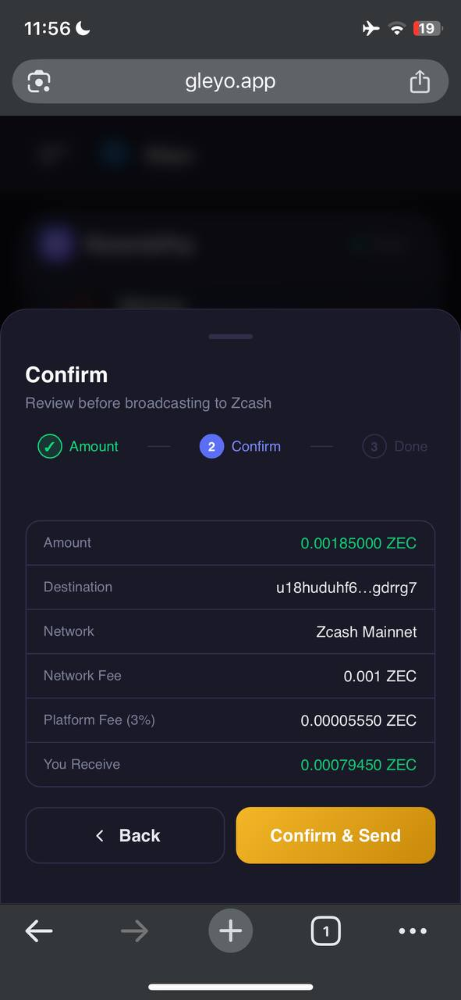
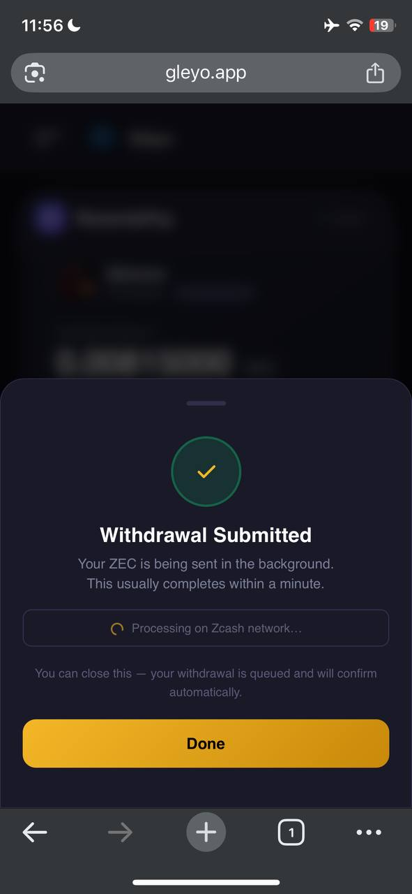
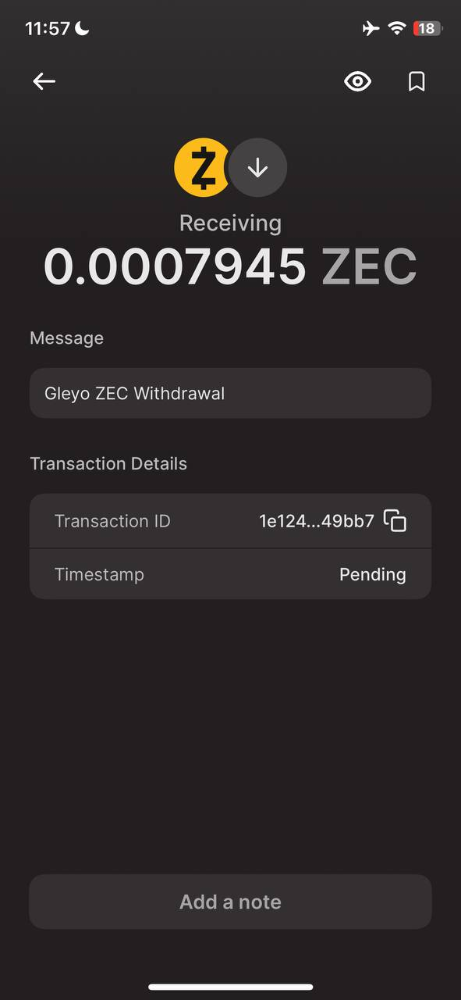

# Gleyo — ZEC-Native Quest & Community Growth Platform

Gleyo is a Zcash-native quest and community growth platform where any project — Zcash ecosystem or otherwise — can create tasks, reward contributors directly in ZEC, and track real community retention. No vanity metrics, no multi-token complexity, no detached Discord. Just ZEC, shielded by default.

Built for the [ZecHub Hackathon 2026](https://zechub.wiki/hackathon) — Infrastructure Track.

🔗 **Live:** [gleyo.app](https://gleyo.app)

Gleyo's feature set naturally spans the contributor lifecycle — education, onboarding, activation, skill development, alignment, and retention — concepts discussed at ZecHub's Contributor Workshop (June 8, 2026).

---

## How it compares

| Feature | Zealy | Gleyo |
|---|---|---|
| Token rewards | Multi-token (points, ERC-20) | **Native ZEC rewards** |
| Wallet login | Web2 + Web3 | **Zcash shielded wallet** |
| Analytics | Discord/Twitter vanity metrics | **Retention rate, dropoff %, growth insights** |
| Community | Detached Discord/Twitter | **Built-in ZEC-native community chat** |
| Privacy | None | **Shielded by default via Orchard** |
| Admin Data Exposure | Exposes user emails, Twitter handles, and Discord IDs to admins | **Strictly hides emails and social IDs; admins only see app usernames** |
| User Identity Leak | Linked emails and social accounts create phishing targeting risk | **No email or social identity exposed to community admins** |
| Reward payout | Custodial | **Non-custodial, straight to user shielded wallet** |
| Zcash support | None | **Native — built on Zcash** |

---

## What Gleyo does

Any project building on Zcash — or any project outside the ecosystem that wants to pay contributors in ZEC — can sign up, fund a community wallet with ZEC, and start creating quests. Here's the full flow:

**For project owners:**
- Create a community and fund it by sending ZEC to Gleyo's shielded address
- Gleyo verifies the deposit via Nozy Wallet + Zebra node (balance delta check on Zcash mainnet)
- Create quests with XP rewards and/or ZEC token rewards
- Publish quests — funds are locked per quest from the community wallet
- Review submissions and approve — ZEC is credited to the winner's reward hub automatically
- View retention analytics: active members over 7d/30d/90d, quest completion rates, average completion time, dropoff percentage, and growth opportunity signals

**For community members:**
- Create an account with email and join a community
- Complete quests and claim XP and/or ZEC rewards straight to your in-app reward hub — no wallet connection required to earn
- When withdrawing, paste the Zcash shielded address (u1...) you want to withdraw to
- Optionally, connect and verify a real Zcash shielded wallet from account settings, via a 0.00001 ZEC micro-transaction with a session code in the memo field — this is purely a convenience so Gleyo remembers your address and you don't have to copy-paste it from your wallet app every time you withdraw. It is **not** required to earn or withdraw ZEC.
- Participate in the community chat

---

## Features

* **ZEC-only rewards** — admins fund tasks in ZEC, users withdraw in ZEC, no other token supported
* **Multi-token funding on-ramp** — project owners can fund their community wallet with USDT or USDC (on Polygon, BSC, or Base) in addition to ZEC directly. Funding via USDT/USDC is auto-converted to ZEC through NEAR Intents (Defuse Protocol) — the community wallet only ever holds ZEC, so every dollar in still becomes ZEC end-to-end, with no other token ever touching Gleyo's balances.
* **Optional Zcash wallet linking** — users earn and withdraw ZEC with no wallet connection required at all; they can simply paste a shielded address at withdrawal time. Optionally, from account settings, a user can connect and verify a real Unified shielded Zcash wallet (u1...) via micro-transaction memo verification, so Gleyo remembers the address and it doesn't need to be re-pasted on future withdrawals.
* **Quest system** — admins create tasks with XP and/or ZEC reward pools, users complete and claim
* **Instant reward crediting** — approved submissions credit ZEC to the user's in-app reward hub immediately
* **Shielded withdrawals** — users withdraw to a Unified shielded address (u1...), routed through Orchard, Gleyo sends via Nozy API with memo `Gleyo ZEC Withdrawal`
* **Multi-platform task system** — quest tasks can require actions across GitHub (star/fork), Discord, Telegram, and YouTube, plus link-visit tasks, with Twitter/X, TikTok, and webhook-based task verification in progress (see limitations)
* **XP & leaderboard standings** — quests can earn XP that builds a member's leaderboard position within each community (some quests are ZEC-only and don't award XP). Members can see their rank and track progress over time, driving ongoing engagement beyond one-time ZEC reward hunting.
* **Community chat** — built-in community space, no Discord required
* **Fully responsive** — works seamlessly across desktop, laptop, tablet, and mobile, giving both contributors and community owners full functionality from any screen
* **Web Push notifications** — members receive real-time notifications inside and outside the app for events like new quest publications, community mentions, and chat activity, even when Gleyo is closed (with browser permission)
* **Retention analytics:**
  - Active members over 7d / 30d / 90d
  - Quest completion rate and average completion time
  - Dropoff percentage with friction point detection
  - Growth opportunity signals: e.g. `2x users are more likely to stay if you run weekly quests`
  - Risk alerts: e.g. `You experienced 2% dropoff — possible onboarding friction on mobile`

---

## Architecture

How Gleyo's components talk to each other in production:



Cloudflare fronts the Flask app and handles DNS/TLS termination. The Flask app and Redis run on AWS EC2, with PostgreSQL on AWS RDS. Everything ZEC-related goes through the Nozy Wallet API, which runs on a separate Contabo VPS alongside the self-hosted Zebra full node, decoupled from the app tier by design.

Nozy's port is not publicly exposed. UFW restricts access to the Flask app's EC2 IP, and every request is authenticated using an API key as a second layer of security. Nozy communicates with Zebra over RPC for balance checks, deposit verification, and shielded transactions, while Zebra maintains its own P2P connection to the Zcash mainnet. Task verification integrations (GitHub, Discord, Telegram, and YouTube), together with email delivery (Resend/SMTP), are shown as dotted lines because they are independent, non-blocking outbound calls from the Flask app. USDT/USDC funding follows the same dotted, non-blocking pattern: the Flask app calls NEAR Intents (Defuse Protocol) to quote and route the swap, and Defuse settles the converted ZEC to Gleyo's shielded Orchard address — the same deposit address Nozy already watches — so no separate confirmation path is needed on Gleyo's side once the swap completes.

---

## How the ZEC flow works

```
Project owner sends ZEC to Gleyo shielded address
        ↓
Gleyo verifies via Nozy API sync (balance delta on Zebra node)
        ↓
Community wallet credited in zatoshi
        ↓
Project owner creates quest with ZEC reward
        ↓
User completes quest → admin approves
        ↓
ZEC credited to user's Gleyo reward hub (UserBalance)
        ↓
User withdraws to their shielded address (typed/pasted, or auto-filled if a wallet was optionally linked)
        ↓
Gleyo sends via Nozy API → Zebra node → Zcash mainnet
        ↓
Transaction confirms in user's wallet within ~3 minutes
```

All transactions are shielded Orchard spends. The memo field on every withdrawal reads `Gleyo ZEC Withdrawal` so the recipient knows exactly where funds came from.

---

## Tech Stack

- **Backend** — Python (Flask), SQLAlchemy, PostgreSQL (production) / SQLite (local dev)
- **Frontend** — HTML, CSS, JavaScript (no framework)
- **Zcash node** — [Zebra](https://github.com/ZcashFoundation/zebra) (Zcash Foundation full node)
- **Wallet backend** — [Nozy Wallet](https://github.com/LEONINE-DAO/Nozy-wallet) by LEONINE DAO (Rust, runs on port 3000)
- **Task integrations** — GitHub OAuth, Discord bot, Telegram bot, YouTube API, link-visit tasks (Twitter/X, TikTok, and webhook-based verification in progress — see limitations)
- **Email** — Resend + SMTP fallback
- **Push notifications** — Web Push (VAPID)
- **Cache** — Redis (also used for session storage, with automatic fallback to filesystem sessions if unavailable)

> Gleyo does not require lightwalletd. Nozy Wallet connects to Zebra directly for compact block sync and shielded transaction broadcasting.

---

## Setup

The short version, to get the app running locally:

```bash
git clone https://github.com/gilmorre/gleyo-Zechub-
cd gleyo-Zechub-

# Windows
python -m venv venv
venv\Scripts\activate

# Mac/Linux
python3 -m venv venv
source venv/bin/activate

pip install -r requirements.txt
python app.py
```

App runs at **http://127.0.0.1:8000**

That gets the app itself running, but full ZEC functionality (deposits, withdrawals, task verification integrations) needs a `.env` file populated, plus a running Zebra node and Nozy API server behind it. All of that — the complete environment variable reference, Zebra node setup, and Nozy API server setup — is in **[SETUP.md](./SETUP.md)**.

---

## Zcash mainnet usage

- All deposits are received at Gleyo's shielded Orchard address
- Deposit verification uses Nozy `/api/sync` balance delta — no memo scanning required for deposits
- Earning and withdrawing ZEC does not require connecting a wallet — a user can simply paste any Zcash shielded address (u1...) at withdrawal time
- Optional wallet verification uses a 0.00001 ZEC micro-transaction with a session code in the shielded memo field, purely so Gleyo can remember the address and save the user from re-pasting it on future withdrawals
- Quest rewards are credited to users' in-app balances on approval
- Withdrawals are sent as shielded Orchard transactions via Nozy API with memo `Gleyo ZEC Withdrawal`, to any Unified shielded address the user provides
- All on-chain activity goes through Zcash mainnet via the self-hosted Zebra node

---

## Live on Zcash Mainnet

A confirmed shielded withdrawal, processed end-to-end through Gleyo's Nozy + Zebra integration:

**1. Fee calculated at withdrawal request** — Gleyo shows the exact amount the user will receive after network fees:



**2. Withdrawal submitted** — the transaction is sent via Nozy API to the Zebra node:



**3. Confirmed in recipient wallet** — the exact predicted amount lands in Zodl within seconds, matching Gleyo's fee calculation precisely:



---

## Current limitations

Gleyo is live and processing real ZEC on mainnet, but it's currently in closed beta while these are addressed before public launch:

- **Security audit** — the codebase has been tested extensively in production with real funds, but hasn't yet had an independent third-party review.
- **Infrastructure redundancy** — Zebra and Nozy currently run on a single VPS without failover.
- **Unified addresses only** — withdrawals currently require a Unified (u1...) shielded address, routed through Orchard. Legacy Sapling-only wallets (zs1...) aren't yet supported for receiving withdrawals; users on older wallets will need to upgrade to a Unified-address wallet.
- **Twitter/X, TikTok, and webhook task verification** — GitHub, Discord, Telegram, YouTube, and link-visit task verification are fully live. Twitter/X verification is currently blocked by API access costs; TikTok requires video-based verification that's still in development; webhook-based task verification is also still under development. All three are being worked on post-hackathon.

---

## Future work

* **Member rewards** — enable project owners to send direct ZEC tips to active community members from within the community chat to encourage participation and recognize contributions.

* **Quest recommendations & AI insights** — introduce personalized quest suggestions and optional AI-assisted review tools to help surface relevant quests, summarize submissions, and assist moderators with reviewing community activity.

* **Expanded wallet onboarding & verification** — simplify the process of connecting and verifying shielded Zcash wallets while keeping access to ZEC-powered functionality secure.

* **Additional notification channels & automation** — expand notifications beyond browser push to include smarter delivery preferences, community activity alerts, and automated engagement workflows.

* **Billing & invoicing tab** — explore optional integration with Zcash-native payment infrastructure (e.g. CipherPay) to support recurring community funding, billing, and invoicing workflows directly in ZEC while preserving Gleyo's native funding model.

* **Expanded multi-token on-ramp** — USDT/USDC funding (via Polygon, BSC, and Base) is live today, auto-converted to ZEC through NEAR Intents. Still to come: ETH, SOL, and fiat on-ramps, using the same auto-convert-to-ZEC model so the platform stays 100% ZEC-native end-to-end regardless of what funding rail a project owner uses.

---

## Credits & Thanks

- **[LOWO](https://github.com/lowo88)** — creator of [Nozy Wallet](https://github.com/LEONINE-DAO/Nozy-wallet), for the relentless bug fixes and quick turnarounds that made shielded payment verification and withdrawals possible
- **[Zcash Foundation](https://www.zfnd.org/)** — for building and maintaining [Zebra](https://github.com/ZcashFoundation/zebra), the full node powering all of Gleyo's mainnet activity
- **[Dismad](https://github.com/dismad)** — for pointing me toward the [ZecHub Developer docs](https://zechub.wiki/developers/quick-start) and guiding me on setting up Zebra
- **[Tron](https://github.com/onajifortune)** — whose tutorial video was a huge help in getting Zebra running
- **Dre & the ZecHub Developer Workshop series** — for creating the space that connected builders with the knowledge, discussions, and technical sessions that helped shape parts of Gleyo's journey.
- **Elzz** — whose Contributor Workshop session on the contributor lifecycle (education → onboarding → activation → retention) directly shaped how Gleyo's quest and retention features were structured.
- **ZecForge** — and the members there who jumped in to actually test Gleyo, connecting wallets, completing shielded withdrawals, and giving real feedback along the way, thank you 🙏

---

## Demo

[Watch the demo](https://youtu.be/Har9yk9Ep04)

---

## License

MIT License — see [LICENSE](./LICENSE)