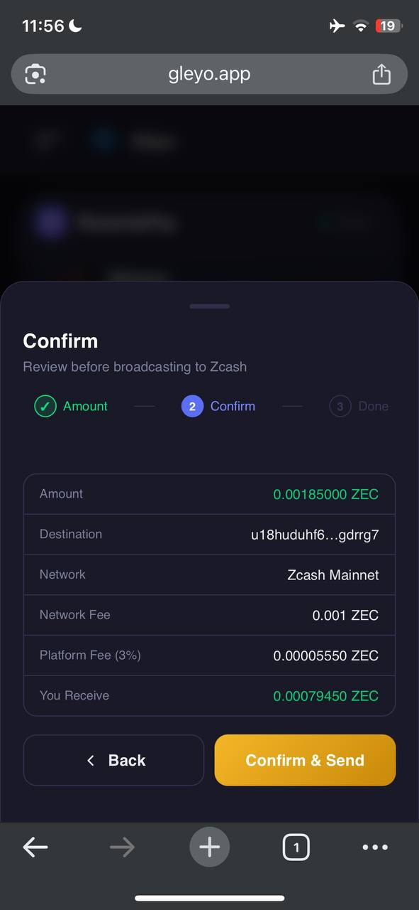
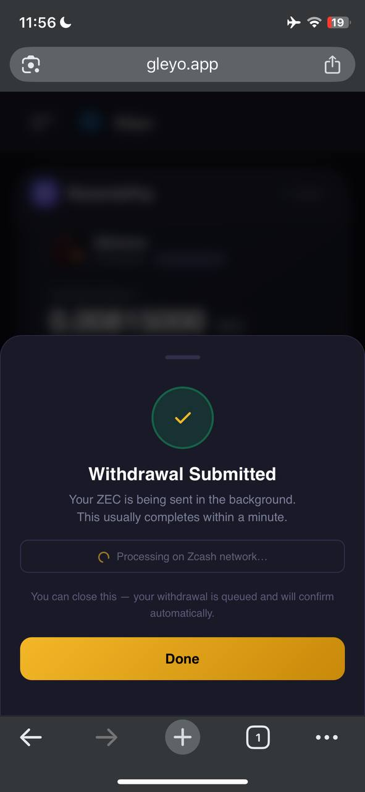
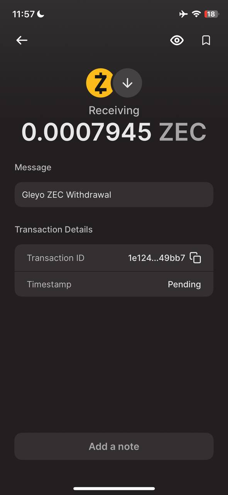

All transactions are shielded Orchard spends. The memo field on every withdrawal reads `Gleyo ZEC Withdrawal` so the recipient knows exactly where funds came from.

---

## Tech Stack

- **Backend** — Python (Flask), SQLAlchemy, PostgreSQL (production) / SQLite (local dev)
- **Frontend** — HTML, CSS, JavaScript (no framework)
- **Zcash node** — [Zebra](https://github.com/ZcashFoundation/zebra) (Zcash Foundation full node)
- **Wallet backend** — [Nozy Wallet](https://github.com/LEONINE-DAO/Nozy-wallet) by LEONINE DAO (Rust, runs on port 3000)
- **Task integrations** — GitHub OAuth, Discord bot, Telegram bot, YouTube API, link-visit tasks (Twitter/X, TikTok, and webhook-based verification in progress — see limitations)
- **Email** — Resend + SMTP fallback
- **Push notifications** — Web Push (VAPID)
- **Cache** — Redis (also used for session storage, with automatic fallback to filesystem sessions if unavailable)

> Gleyo does not require lightwalletd. Nozy Wallet connects to Zebra directly for compact block sync and shielded transaction broadcasting.

---

## Setup

Clone the repository and create a virtual environment:

```bash
git clone https://github.com/gilmorre/gleyo-Zechub-.git
cd gleyo-Zechub-

# Windows
python -m venv venv
venv\Scripts\activate

# macOS / Linux
python3 -m venv venv
source venv/bin/activate

python -m pip install --upgrade pip
pip install -r requirements.txt
```

### Create your `.env`

Before starting the app, create a `.env` file in the project root.

At a minimum, the following are required for the application to start:

```env
SUPABASE_URL=your_supabase_project_url
SUPABASE_KEY=your_supabase_anon_key
```

Additional environment variables are required depending on the features you want to use (ZEC deposits, withdrawals, Defuse swaps, Redis, Discord integration, email, OAuth providers, etc.).

The complete list of environment variables and setup instructions is available in **[SETUP.md](./SETUP.md)**.

### Run the application

```bash
python app.py
```

Once your `.env` has been configured correctly, the application will be available at:

**http://127.0.0.1:8000**

---

## Zcash mainnet usage

- All deposits are received at Gleyo's shielded Orchard address
- Deposit verification uses Nozy `/api/sync` balance delta — no memo scanning required for deposits
- Earning and withdrawing ZEC does not require connecting a wallet — a user can simply paste any Zcash shielded address (u1...) at withdrawal time
- Optional wallet verification uses a 0.00001 ZEC micro-transaction with a session code in the shielded memo field, purely so Gleyo can remember the address and save the user from re-pasting it on future withdrawals
- Quest rewards are credited to users' in-app balances on approval
- Withdrawals are sent as shielded Orchard transactions via Nozy API with memo `Gleyo ZEC Withdrawal`, to any Unified shielded address the user provides
- All on-chain activity goes through Zcash mainnet via the self-hosted Zebra node

---

## Live on Zcash Mainnet

A confirmed shielded withdrawal, processed end-to-end through Gleyo's Nozy + Zebra integration:

**1. Fee calculated at withdrawal request** — Gleyo shows the exact amount the user will receive after network fees:



**2. Withdrawal submitted** — the transaction is sent via Nozy API to the Zebra node:



**3. Confirmed in recipient wallet** — the exact predicted amount lands in Zodl within seconds, matching Gleyo's fee calculation precisely:



---

## Current limitations

Gleyo is live and processing real ZEC on mainnet, but it's currently in closed beta while these are addressed before public launch:

- **Security audit** — the codebase has been tested extensively in production with real funds, but hasn't yet had an independent third-party review.
- **Infrastructure redundancy** — Zebra and Nozy currently run on a single VPS without failover.
- **Unified addresses only** — withdrawals currently require a Unified (u1...) shielded address, routed through Orchard. Legacy Sapling-only wallets (zs1...) aren't yet supported for receiving withdrawals; users on older wallets will need to upgrade to a Unified-address wallet.
- **Twitter/X, TikTok, and webhook task verification** — GitHub, Discord, Telegram, YouTube, and link-visit task verification are fully live. Twitter/X verification is currently blocked by API access costs; TikTok requires video-based verification that's still in development; webhook-based task verification is also still under development. All three are being worked on post-hackathon.

---

## Future work

* **Member rewards** — enable project owners to send direct ZEC tips to active community members from within the community chat to encourage participation and recognize contributions.

* **Quest recommendations & AI insights** — introduce personalized quest suggestions and optional AI-assisted review tools to help surface relevant quests, summarize submissions, and assist moderators with reviewing community activity.

* **Expanded wallet onboarding & verification** — simplify the process of connecting and verifying shielded Zcash wallets while keeping access to ZEC-powered functionality secure.

* **Additional notification channels & automation** — expand notifications beyond browser push to include smarter delivery preferences, community activity alerts, and automated engagement workflows.

* **Billing & invoicing tab** — explore optional integration with Zcash-native payment infrastructure (e.g. CipherPay) to support recurring community funding, billing, and invoicing workflows directly in ZEC while preserving Gleyo's native funding model.

* **Expanded multi-token on-ramp** — USDT/USDC funding (via Polygon, BSC, and Base) is live today, auto-converted to ZEC through NEAR Intents. Still to come: ETH, SOL, and fiat on-ramps, using the same auto-convert-to-ZEC model so the platform stays 100% ZEC-native end-to-end regardless of what funding rail a project owner uses.

---

## Credits & Thanks

- **[LOWO](https://github.com/lowo88)** — creator of [Nozy Wallet](https://github.com/LEONINE-DAO/Nozy-wallet), for the relentless bug fixes and quick turnarounds that made shielded payment verification and withdrawals possible
- **[Zcash Foundation](https://www.zfnd.org/)** — for building and maintaining [Zebra](https://github.com/ZcashFoundation/zebra), the full node powering all of Gleyo's mainnet activity
- **[Dismad](https://github.com/dismad)** — for pointing me toward the [ZecHub Developer docs](https://zechub.wiki/developers/quick-start) and guiding me on setting up Zebra
- **[Tron](https://github.com/onajifortune)** — whose tutorial video was a huge help in getting Zebra running
- **Dre & the ZecHub Developer Workshop series** — for creating the space that connected builders with the knowledge, discussions, and technical sessions that helped shape parts of Gleyo's journey.
- **Elzz** — whose Contributor Workshop session on the contributor lifecycle (education → onboarding → activation → retention) directly shaped how Gleyo's quest and retention features were structured.
- **ZecForge** — and the members there who jumped in to actually test Gleyo, connecting wallets, completing shielded withdrawals, and giving real feedback along the way, thank you 🙏

---

## Demo

[Watch the demo](https://youtu.be/Har9yk9Ep04)

---

## License

MIT License — see [LICENSE](./LICENSE)
